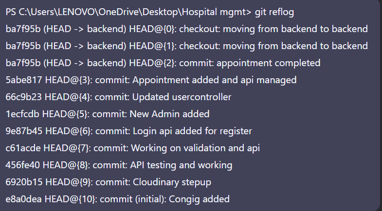

# Hospital Management System  

A system application designed to streamline hospital operations, including patient registration, doctor appointments, and medical records management.  

---

##  **Objective**  
- Digitize patient and doctor workflows.  
- Manage appointments, medical history, and prescriptions efficiently.  
- Provide secure access for admin, doctors, and patients.  

---

## **Tools & Technologies**  

### **Frontend (React.js)**  
- React.js (Functional Components + Hooks)  
- React Router (Navigation)  
- Context API / Redux (State Management)  
- Axios (API Calls)  
- Material-UI / TailwindCSS (Styling)  

### **Backend (Node.js & Express.js)**  
- Node.js (Runtime)  
- Express.js (Server Framework)  
- MongoDB (Database)  
- Mongoose (ODM)  
- JWT (Authentication)  
- Bcrypt (Password Hashing)  

### **Testing & Deployment**  
- Postman (API Testing)  
- Firebase / Vercel (Frontend Hosting)  
- Render / AWS (Backend Hosting)  

---

## Images

## Conclusion
This **Hospital Management System** demonstrates the power of the **MERN stack** (MongoDB, Express.js, React.js, Node.js) in building:  
✔ **Scalable** - Handles growing patient/doctor data efficiently  
✔ **Secure** - JWT authentication & encrypted data  
✔ **Efficient** - Streamlines hospital workflows  

### 🔮 Future Enhancements  
- **AI Diagnostics** - Predictive analysis for patient health  
- **Telemedicine** - Video consultations & remote care  
- **Multi-language Support** - For global accessibility  
- **IoT Integration** - Wearable health monitoring

# Lost Commit Recovery

Critical backend commits were lost during development. Recovered via `git reflog` - includes appointment logic, auth APIs, and Cloudinary setup.

